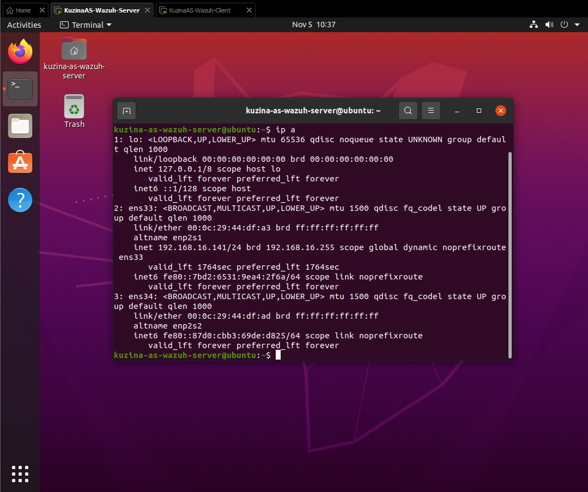

# **Практика №3 по предмету СДССиЛ - Wazuh**
Выполнил(а) студент Кузина А.С. группы ББМО-02-23
# **Выполнение практики:**

## **Шаг 1. Развертывание ВМ:**
### **Серверная ВМ:**

### **Клиентская ВМ:**

## **Шаг 2. Обеспечение сетевого обмена между 2 ВМ:**

## **Шаг 3. Развертывание на серверной ВМ Wazuh-сервера:**

### **Проверка работы web-интерфейса Wazuh:**

## **Шаг 4. Подключение агента к клиентской ВМ:**
### **Создание команд на Wazuh-сервере**

### **Установка агента на клиентской ВМ:**
