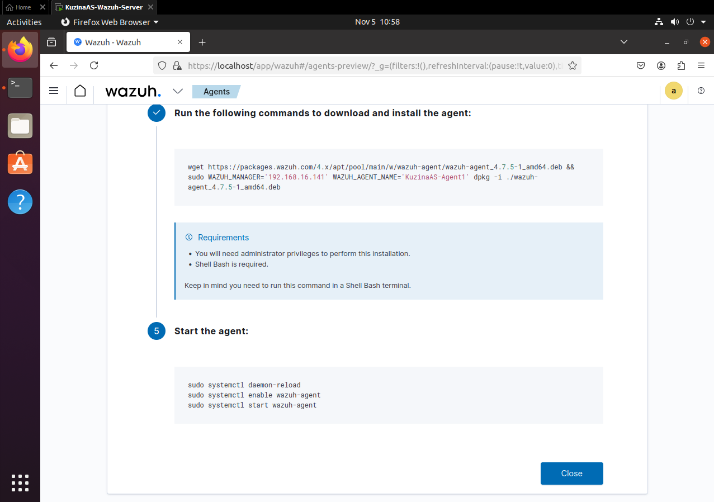
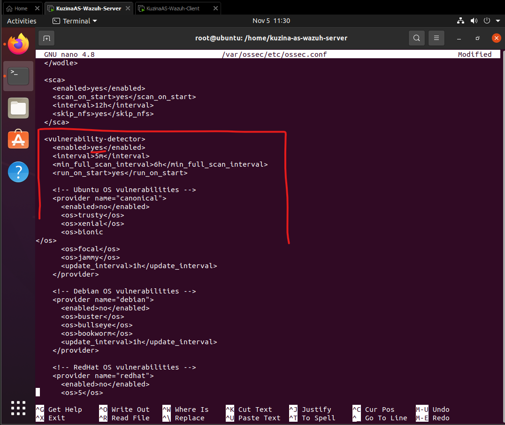

# **Практика №3 по предмету СДССиЛ - Wazuh**
Выполнил(а) студент Кузина А.С. группы ББМО-02-23
# **Выполнение практики:**

## **Шаг 1. Развертывание ВМ:**
### **Серверная ВМ:**

### **Клиентская ВМ:**

## **Шаг 2. Обеспечение сетевого обмена между 2 ВМ:**

## **Шаг 3. Развертывание на серверной ВМ Wazuh-сервера:**

### **Проверка работы web-интерфейса Wazuh:**

## **Шаг 4. Подключение агента к клиентской ВМ:**
### **Создание команд на Wazuh-сервере**

### **Установка агента на клиентской ВМ:**

## **Шаг 5. Проверка правильности установки агента (отображение в Wazuh):**

### **Детектор уязвимостей для установленного агента:**

## **Шаг 6. Создание проверки целостности файлов:**

## **Шаг 7. Настройка выявления уязвимостей:**

## **Шаг 8. Настройка выявления скрытых процессов:**

## **Шаг 9. Настройка выявления SQL-инъекций:**

## **Шаг 10. Настройка выявления web shell attack (аналогично пункту 9):**

## **Шаг 11. Проверка работы настроеннх ранее механизмов:**
