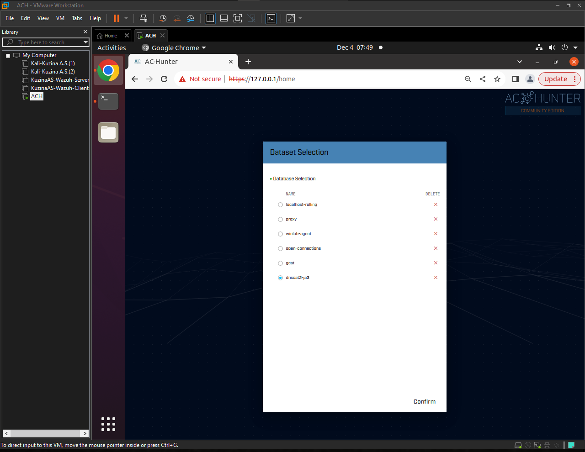
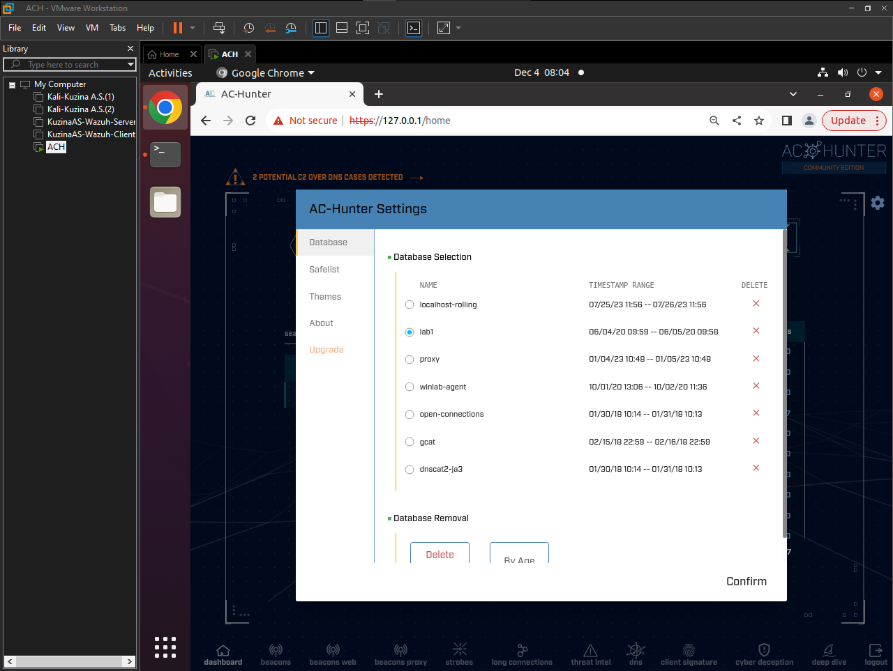

# **Практика №4 по предмету СДССиЛ - Network Threat Hunting**
Выполнил(а) студент Кузина А.С. группы ББМО-02-23
# **Выполнение практики:**
## **Шаг 1. Развертывание ВМ и запуск стенда:**
### **Скачанная и запущенная ВМ:**

### **Web-интерфейс развернутого стенда:**

### **Выбор датасета для работы:**

### **Стартовая страница после аутентификации и выбора датасета развернутого стенда:**

### **Пример добавления адреса в safelist (skype.com):**
#### **Переходим в модуль beacons web:**

#### **Выбор нужного адреса:**

#### **Добавление адреса в safelist:**

### **Проверка safelist на наличие добавленного ранее адреса:**

## **Шаг 2. Выполнение заданий из lab1:**
### **Переход в нужную директорию и импорт логов:**

### **Переключаемся на нужный датасет с загруженными ранее логами в web-итерфейсе:**

### **Стартовая страница с обнаруженными адресами и beacon score:**

### **Переход в beacons web для анализа адресов:**

### **Проверяем первый адрес:**

**Вывод по адресу** - Адрес демонстрирует подозрительную вредоносность из-за количества подключений (3011), а также стабильности и прямолинейности графика зависимости количества подключений ко времени. Также не отображается полное доменное имя хоста, что может говорить о его вредоносности.
### **Проверяем остальные адреса (для примера разберем 2 и 3 адреса):**

**Вывод по адресам** - Оба адреса и все последующие из списка относятся к компонентам и программам microsoft и вызывают больше доверия. Так же они не обладают огромным количеством подключений. Из этого можно сделать вывод что данные адреса безопасны. Добавим по примеру, описанному выше, данные адреса в safelist
### **Проверка отображения добавленных ранее безопасных адресов в safelist:**

## **Шаг 3. Выполнение заданий из lab2:**

## **Шаг 4. Выполнение заданий из lab3:**
