# **Практика №5 по предмету СДССиЛ - Threat Hunting**
Выполнил(а) студент Кузина А.С. группы ББМО-02-23
# **Выполнение практики:**

## **Шаг 1. Развертывание ВМ, запуск стенда и проверка Wazuh:**
**ВМ были взяты с практической работы 3, где были реализованы Wazuh-сервер и Wazuh-агент**
### **1.1 Проверка связи между двумя ВМ:** 
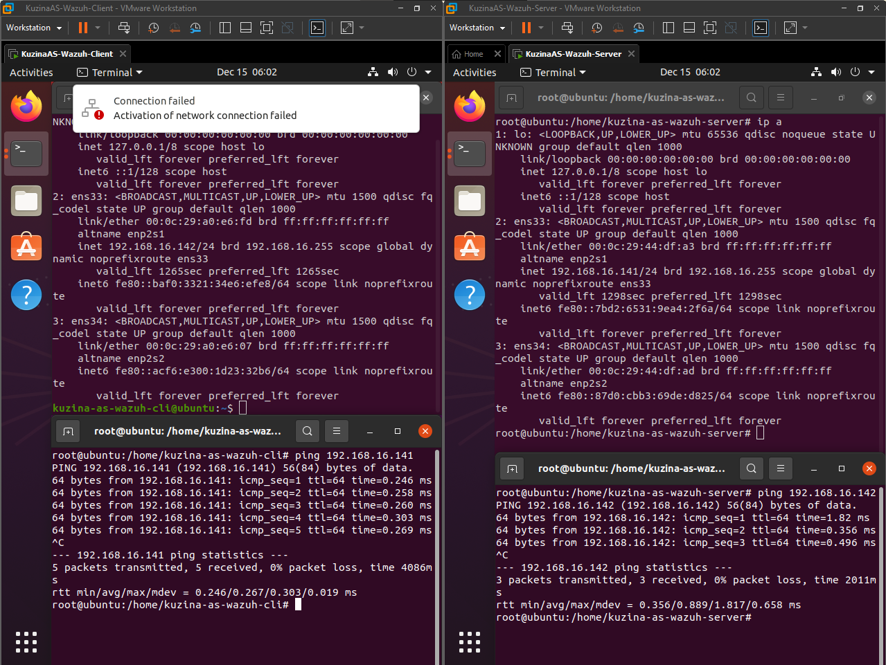
### **1.2 Проверка работоспособности Wazuh-сервера и отображения в нем агента:**
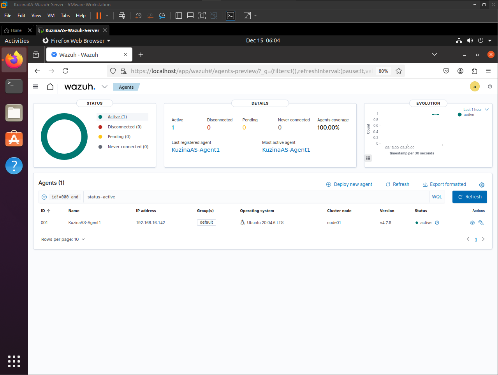

## **Шаг 2. Установка IDS/IPS утилиты Suricata для передачи обнаружений в Wazuh:**

**Клиентская ВМ**

### **2.1 Установка Suricata на ВМ с агентом Wazuh:**
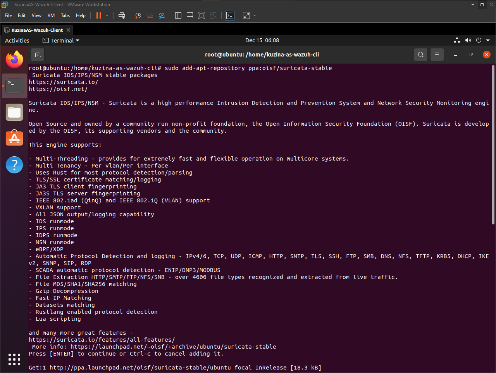
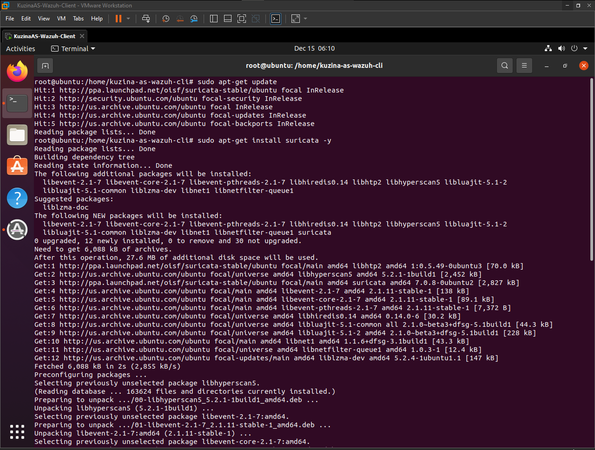
### **2.2 Установка набора правил для корректного обнаружения в Suricata:**
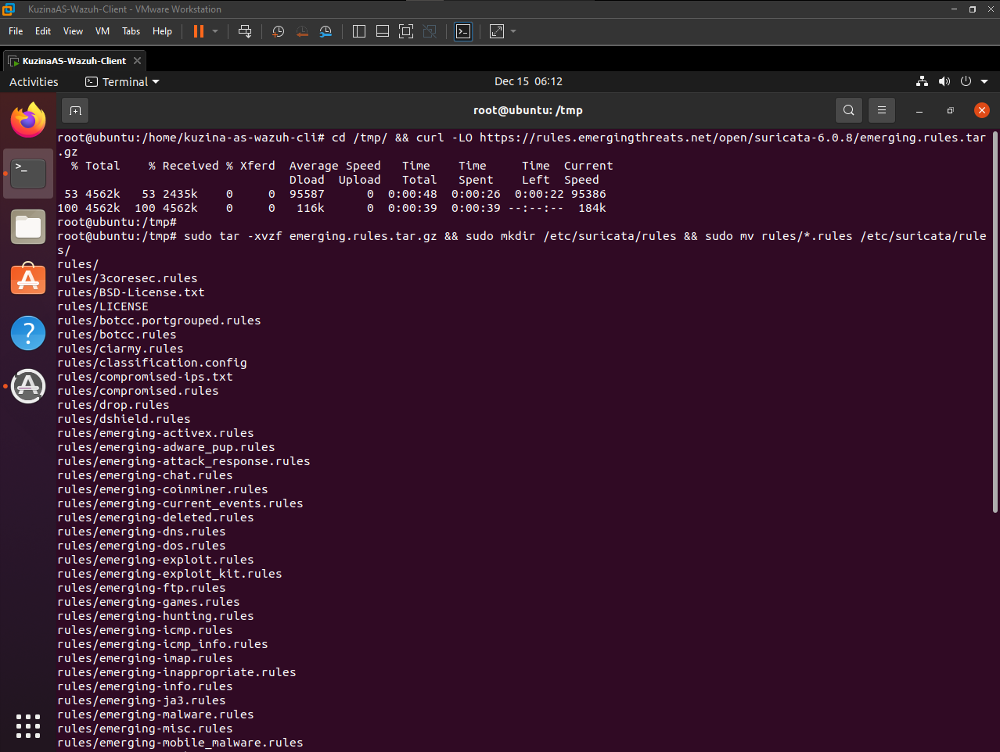
### **2.3 Выдача прав на файл с правилами Suricata:**
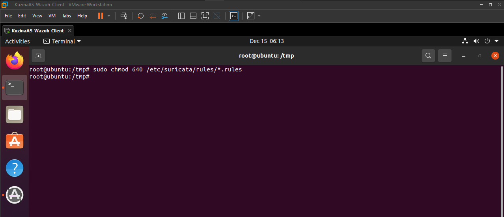
### **2.4 Настройка конфигурационного файла Suricata:**
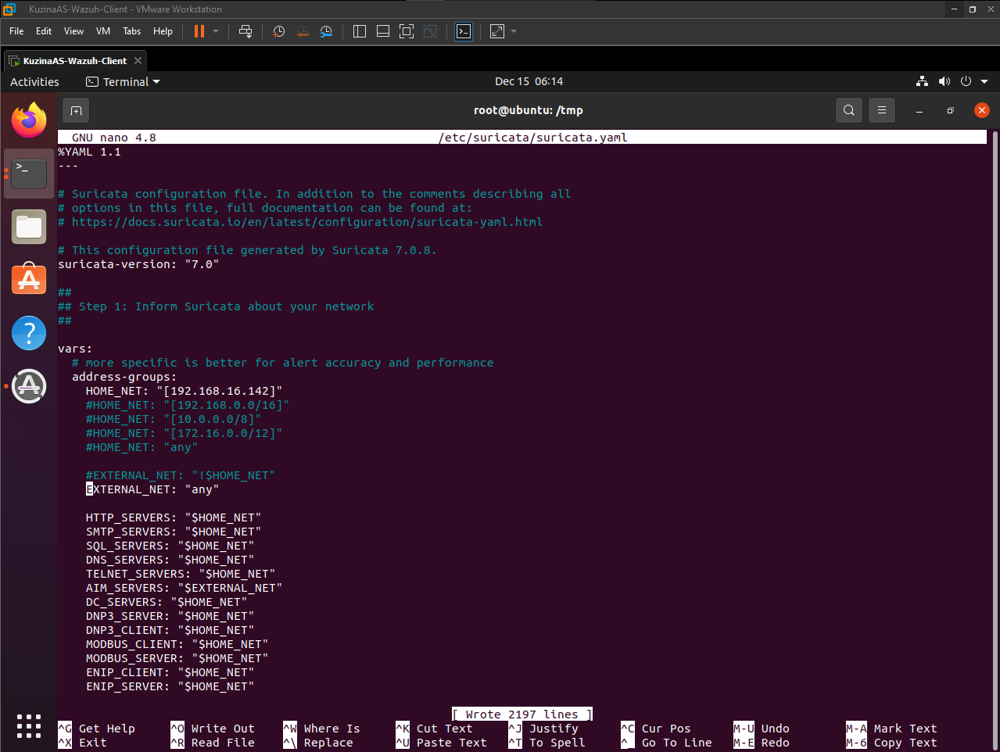
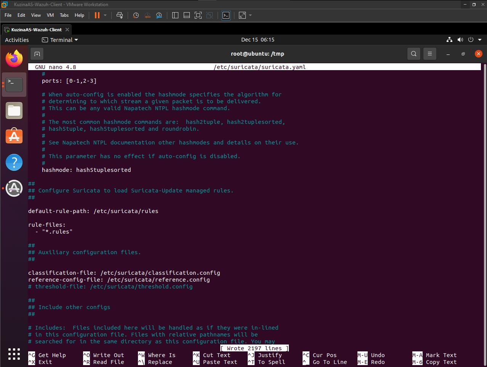
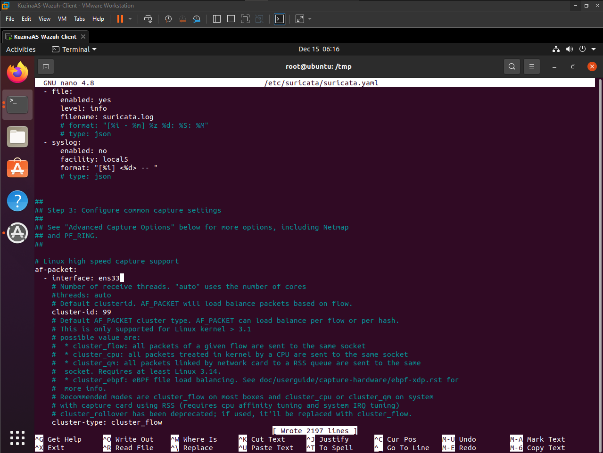
### **2.5 Перезапуск Suricata для применения изменений:**
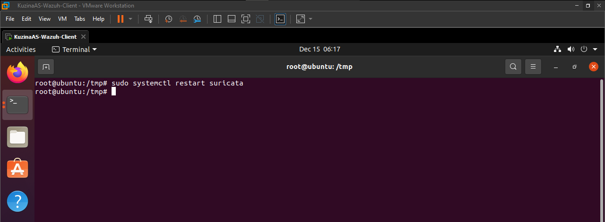
### **2.6 Настройка конфигурационного файла Wazuh-agent для работы с Suricata:**
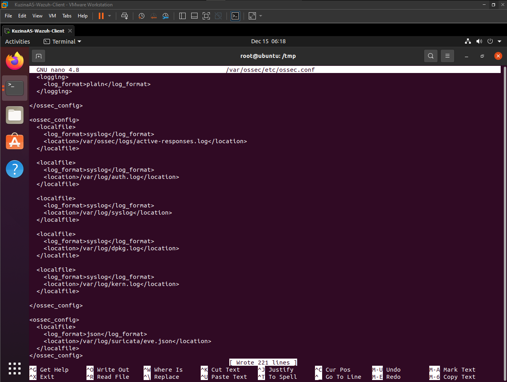
### **2.5 Перезапуск Wazuh-agent для применения изменений:**
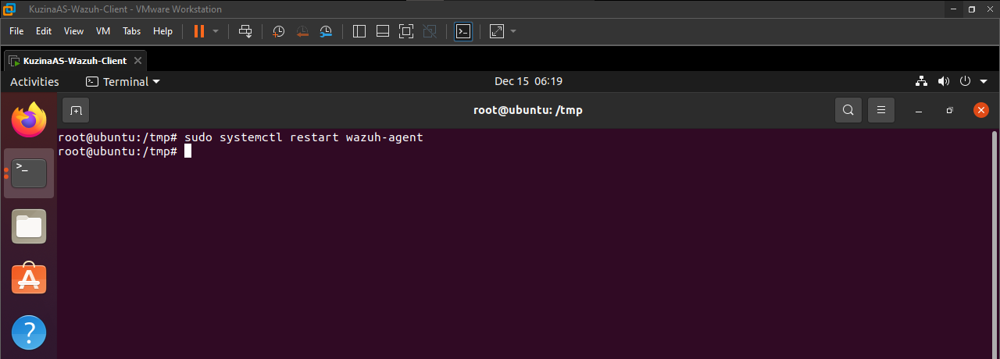

**Серверная ВМ**

### **2.6 Реализация активности на Серверной ВМ направленной на Клиентскую ВМ для обнаружения:**
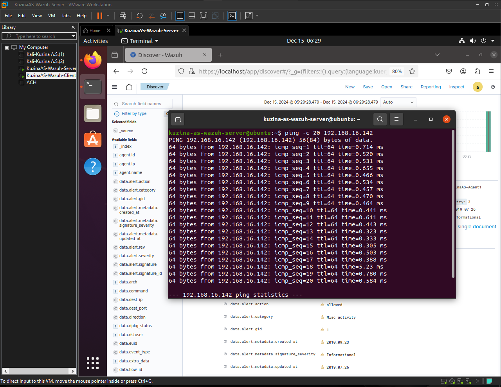
### **2.7 Результат обнаружения в Wazuh:**
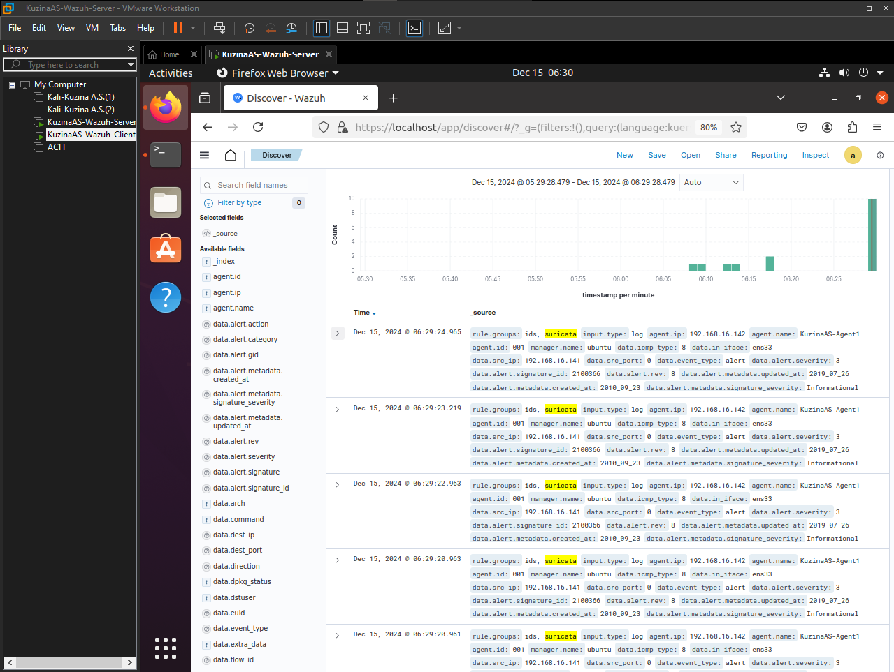
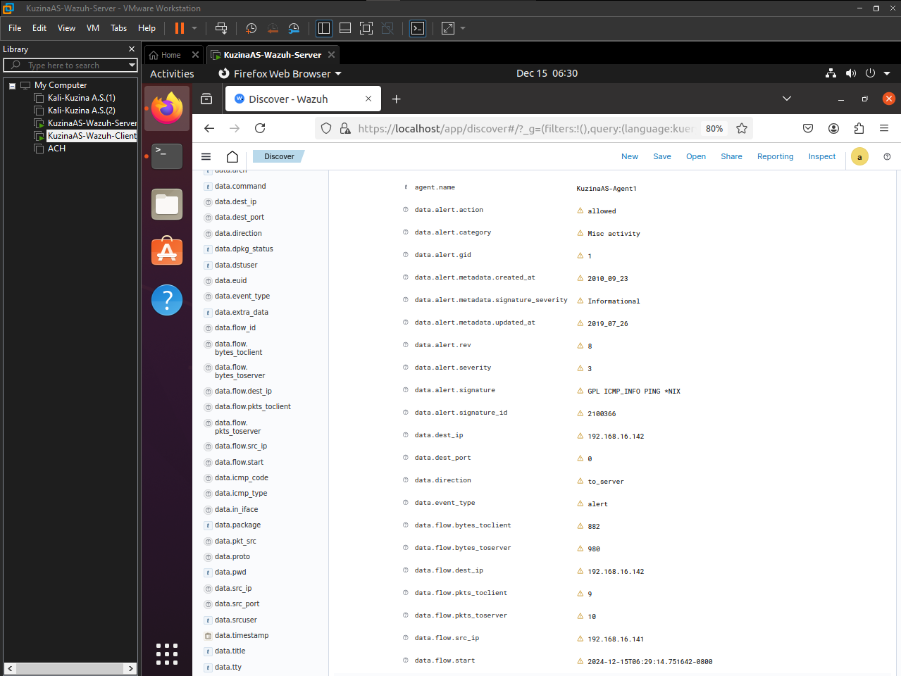

