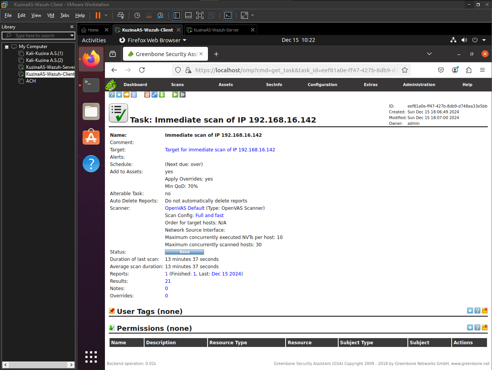

# **Практика №5 по предмету СДССиЛ - Threat Hunting**
Выполнил(а) студент Кузина А.С. группы ББМО-02-23
# **Выполнение практики:**

## **Шаг 1. Развертывание ВМ, запуск стенда и проверка Wazuh:**
**ВМ были взяты с практической работы 3, где были реализованы Wazuh-сервер и Wazuh-агент**
### **1.1 Проверка связи между двумя ВМ:** 

### **1.2 Проверка работоспособности Wazuh-сервера и отображения в нем агента:**

## **Шаг 2. Установка IDS/IPS утилиты Suricata для передачи обнаружений в Wazuh:**

**Клиентская ВМ**

### **2.1 Установка Suricata на ВМ с агентом Wazuh:**

### **2.2 Установка набора правил для корректного обнаружения в Suricata:**

### **2.3 Выдача прав на файл с правилами Suricata:**

### **2.4 Настройка конфигурационного файла Suricata:**

### **2.5 Перезапуск Suricata для применения изменений:**

### **2.6 Настройка конфигурационного файла Wazuh-agent для работы с Suricata:**

### **2.5 Перезапуск Wazuh-agent для применения изменений:**

**Серверная ВМ**

### **2.6 Реализация активности на Серверной ВМ направленной на Клиентскую ВМ для обнаружения:**

### **2.7 Результат обнаружения в Wazuh:**

## **Шаг 3. Установка ThreatHuntingTools утилиты YARA для передачи обнаружений в Wazuh:**

**Клиентская ВМ**

### **3.1 Процесс установки YARA на клиентскую ВМ:**

### **3.2 Проверка установки YARA:**

### **3.3 Исправление ошибки при запуске YARA:**

### **3.4 Установка набора правил для корректных обнаружений YARA:**

### **3.5 Создание скрипта yara.sh для активного обнаружения YARA:**

### **3.6 Выдача прав на созданный скрипт yara.sh:**

### **3.7 Редактирование конфигурационного файла Wazuh-agent для работы с YARA:**

### **3.8 Перезапуск Wazuh-agent для применения изменений:**

**Серверная ВМ**

### **3.9 Создание кастомного декодера для YARA:**

### **3.10 Создание локальных правил для проверки YARA:**

### **3.11 Редактирование конфигурационного файла Wazuh для работы с YARA:**

### **3.12 Перезапуск Wazuh для применения изменений:**

### **3.13 На Клиентской ВМ выполним имитацию вредоносных действий:**

### **3.14 В Wazuh на Серверной ВМ видим результат обнаружения угроз:**

## **Шаг 4. Установка ScanerTools утилиты OpenVAS:**
### **4.1 Установка докера для дальнейшей установки OpenVAS на Клиенствкую ВМ:**

### **4.2 Процесс установки OpenVAS на Клиенствкую ВМ:**

### **4.3 Запуск web-интерфейса OpenVAS:**

### **4.4 Проверка конфигураций для сканирования и их обновление:**

### **4.5 Запуск сканирования Клиентской ВМ по IP адресу:**

### **4.6 Отображение нового задания на сканирование в OpenVAS:**

### **4.7 Результаты проведенного сканирования:**

### **4.8 Wazuh отображает активности на анализируемом агенте, которые дублируют конфигурации сканирования OpenVAS:**

